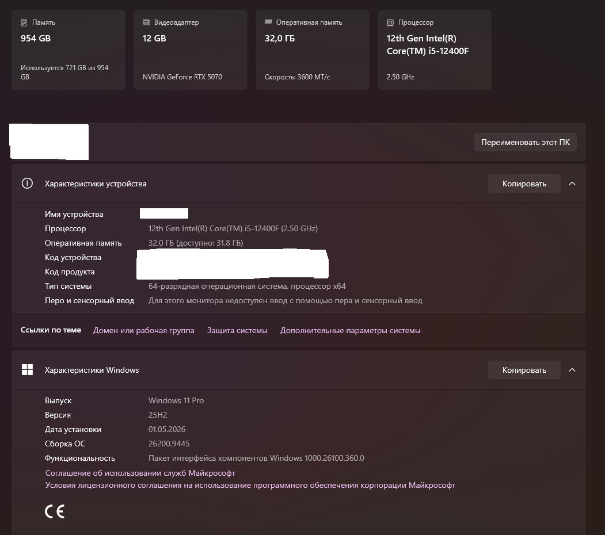
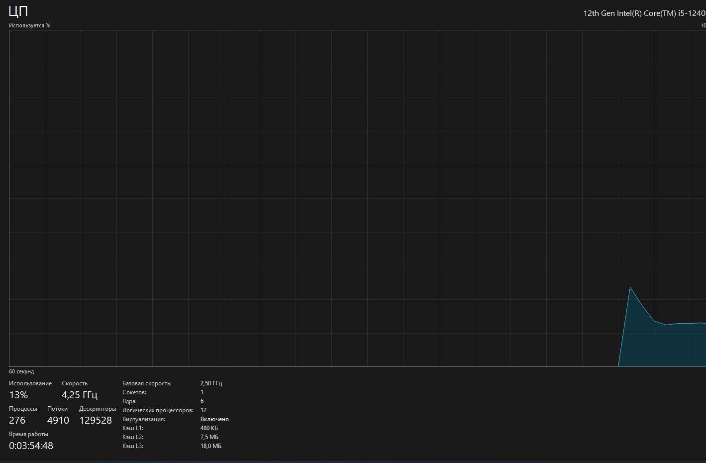
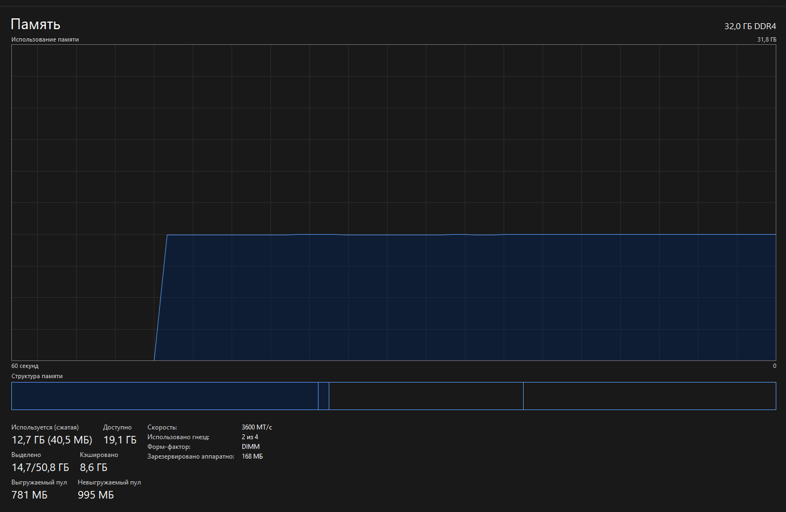
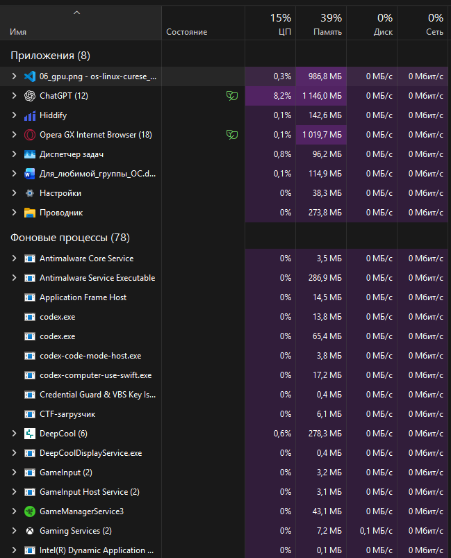
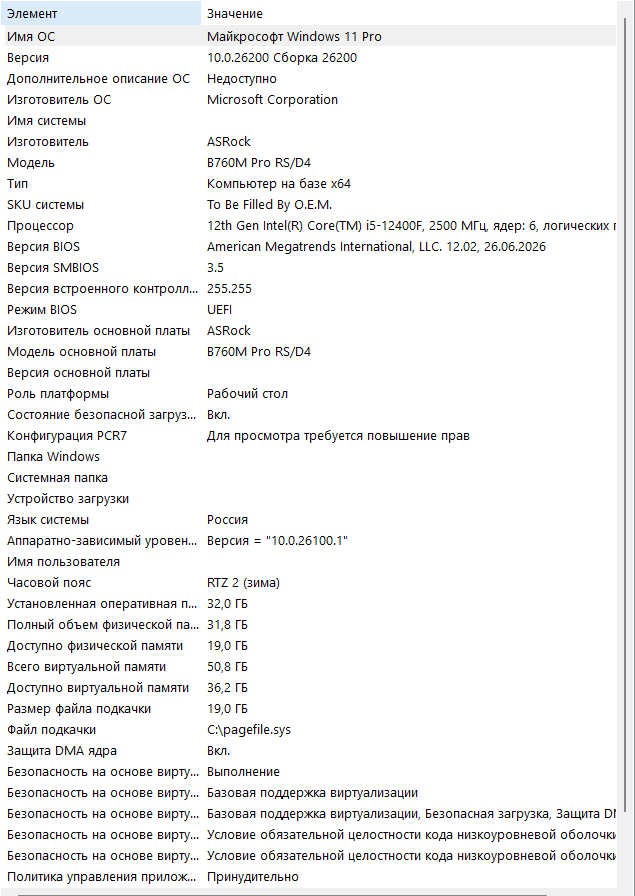

# Проверка данных компьютера

## Использованные средства

- `winver`
- Параметры Windows
- Диспетчер задач
- Сведения о системе (`msinfo32`)

## Проверка двумя способами

| Что проверялось | Способ 1 | Способ 2 | Результат |
| :-- | :-- | :-- | :-- |
| Windows | `winver`: Windows 11 Pro, 25H2, сборка 26200.9445 | `msinfo32`: Windows 11 Pro, версия 10.0.26200, сборка 26200 | Совпало. `msinfo32` не показывает номер обновления `.9445` и обозначение `25H2`. |
| Процессор | Параметры: Intel Core i5-12400F, 2.50 ГГц | Диспетчер задач: Intel Core i5-12400F, 6 ядер, 12 логических процессоров | Совпало. |
| Оперативная память | Параметры: 32,0 ГБ, доступно 31,8 ГБ | Диспетчер задач: 32,0 ГБ DDR4, доступно системе 31,8 ГБ | Совпало. |

## Скриншоты проверки

### Параметры Windows

Здесь видны Windows 11 Pro 25H2, процессор Intel Core i5-12400F и 32,0 ГБ памяти.

### Процессор

Диспетчер задач показывает 6 ядер, 12 логических процессоров и включённую виртуализацию.

### Оперативная память

Установлено 32,0 ГБ DDR4. Во время снимка использовалось 12,7 ГБ, доступно было 19,1 ГБ.

### Процессы

На снимке одновременно работают приложения и фоновые процессы. Видны столбцы CPU и памяти.

### Сведения о системе

`msinfo32` подтверждает Windows 11 Pro, процессор Intel Core i5-12400F и 32,0 ГБ памяти.

## Три процесса

| Процесс | Для чего нужен | CPU | Память |
| :-- | :-- | --: | --: |
| ChatGPT | Работа с ИИ | 8,2% | 1146,0 МБ |
| Opera GX | Просмотр сайтов | 0,1% | 1019,7 МБ |
| Проводник | Работа с файлами | 0% | 273,8 МБ |

Значения взяты со скриншота и могут меняться во время работы.

## Короткие ответы

**Что относится к пользовательскому пространству?**  
ChatGPT, Opera GX, VS Code, Проводник и другие запущенные приложения.

**Зачем ОС управляет CPU, RAM, диском и устройствами?**  
Чтобы программы безопасно делили ресурсы и не мешали друг другу.

**Где ОС работает как посредник?**  
При запуске программ, чтении файлов, использовании памяти и обращении к устройствам.
