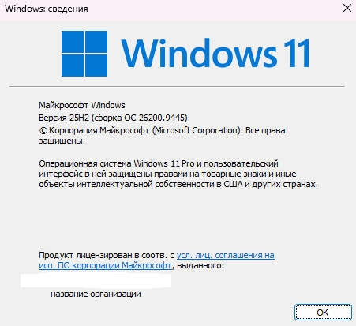
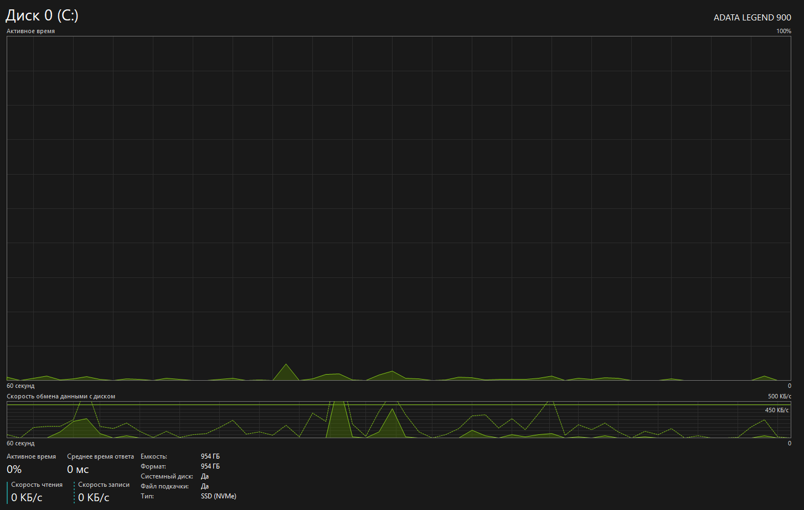
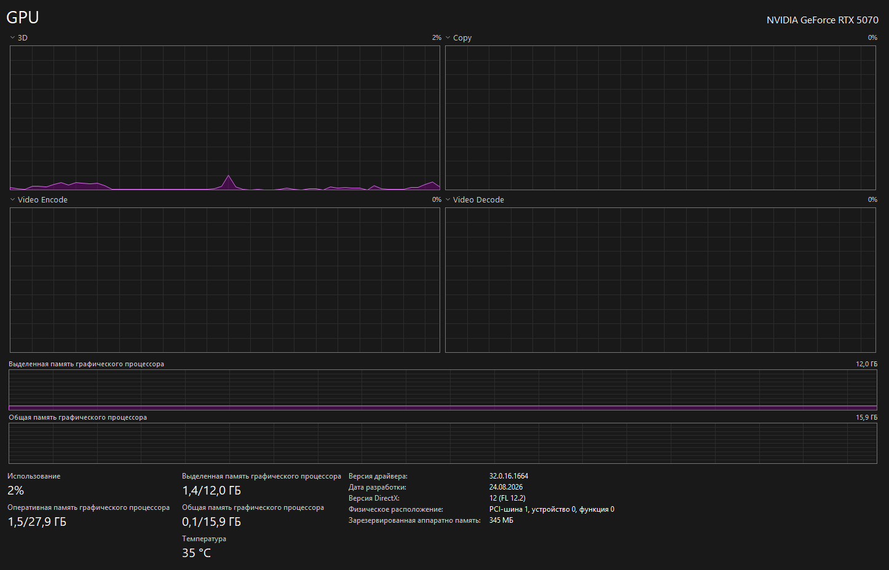

# Системный паспорт компьютера

**Дата диагностики:** 13.09.2026

**Использованные инструменты:**

- `winver`
- Параметры Windows
- Диспетчер задач
- Сведения о системе (`msinfo32`)
- PowerShell и командная строка

## Характеристики

| Что проверено | Результат | Источник |
| :-- | :-- | :-- |
| Операционная система | Windows 11 Pro, версия 25H2 | `winver`, Параметры |
| Сборка Windows | 26200.9445 | `winver`, Параметры |
| Архитектура | 64-разрядная ОС, процессор x64 | Параметры |
| Процессор | Intel Core i5-12400F, 2.50 ГГц | Параметры, Диспетчер задач |
| Ядра и потоки | 6 ядер, 12 логических процессоров | Диспетчер задач |
| Загрузка CPU | 13% во время снимка | Диспетчер задач |
| Оперативная память | 32,0 ГБ DDR4, доступно системе 31,8 ГБ | Параметры, Диспетчер задач |
| Использование RAM | 12,7 ГБ занято, 19,1 ГБ доступно | Диспетчер задач |
| Накопитель | ADATA LEGEND 900, SSD NVMe | Диспетчер задач |
| Объём диска C: | 954 ГБ | Параметры, Диспетчер задач |
| Место на диске C: | 721 ГБ занято, около 233 ГБ свободно | Параметры |
| Загрузка диска | 0% во время снимка | Диспетчер задач |
| Видеокарта | NVIDIA GeForce RTX 5070 | Параметры, Диспетчер задач |
| Видеопамять | 12,0 ГБ | Диспетчер задач |
| Загрузка GPU | 2%, температура 35 °C | Диспетчер задач |
| BIOS | Режим UEFI | `msinfo32` |
| Виртуализация | Включена | Диспетчер задач |
| Процесс ChatGPT | 8,2% CPU, 1146,0 МБ RAM | Диспетчер задач |
| Процесс Opera GX | 0,1% CPU, 1019,7 МБ RAM | Диспетчер задач |
| Процесс Проводник | 0% CPU, 273,8 МБ RAM | Диспетчер задач |
| Терминалы | PowerShell, cmd, Windows Terminal | Командная строка |
| Среда разработки | VS Code 1.137.0, Python 3.12.0 | Командная строка |

## Скриншоты

### Версия Windows

Установлена Windows 11 Pro 25H2, сборка 26200.9445.

### Сведения о компьютере

Здесь видны Windows, процессор, RAM и тип системы.

### Процессор

Процессор имеет 6 ядер и 12 логических процессоров. Виртуализация включена.

### Оперативная память

Установлено 32,0 ГБ DDR4. Во время снимка занято 12,7 ГБ.

### Накопитель

Системный диск — SSD NVMe ADATA LEGEND 900 объёмом 954 ГБ.

### Видеокарта

Установлена NVIDIA GeForce RTX 5070 с 12,0 ГБ видеопамяти.

### Сведения о системе

`msinfo32` подтверждает модель процессора, объём RAM и режим UEFI.

## Вывод

Компьютер подходит для программирования: процессор имеет 6 ядер и 12 потоков, а оперативной памяти 32 ГБ. SSD ускоряет запуск программ и работу с файлами. Для виртуальных машин ресурсов достаточно, и виртуализация включена. На диске свободно около 233 ГБ, поэтому для нескольких больших виртуальных машин может понадобиться больше места. Компьютер подходит для Linux-сред через виртуальную машину или WSL.
